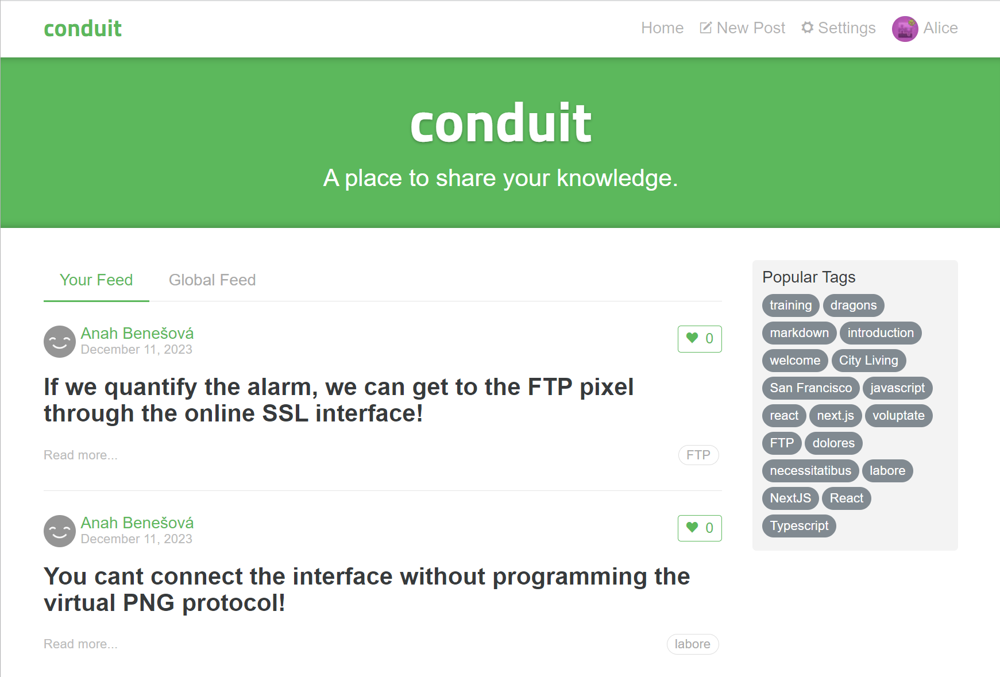

# 

### Next.js 14, React, Prisma, Postgres

demo available
at [https://next-fullstack-realworld-app.vercel.app/](https://next-fullstack-realworld-app.vercel.app/)

## Screenshot



## Development

First, run the development server:

```
docker-compose up --build --force-recreate
```

Open http://localhost:3000 with your browser to see the result.

## Production

```
# Build prod
docker compose -f docker-compose.production.yml build

# Up prod in detached mode
docker compose -f docker-compose.production.yml up -d
```

Open http://localhost:3000.

## Key Features

1. Authentication via Next-Auth
2. Login/ Register
3. Articles: Create, Edit, Delete
4. Filter articles by tag, author, favorited
5. Comments on articles
6. Favorite articles
7. Follow other users
8. i18n: English, Chinese Simplified

## References

- [vue3-realworld-example-app](https://github.com/gardenofdev/vue3-realworld-example-app)
- [realworld](https://github.com/gothinkster/realworld)
- [react-realworld-example-app](https://github.com/gardenofdev/react-realworld-example-app/)
